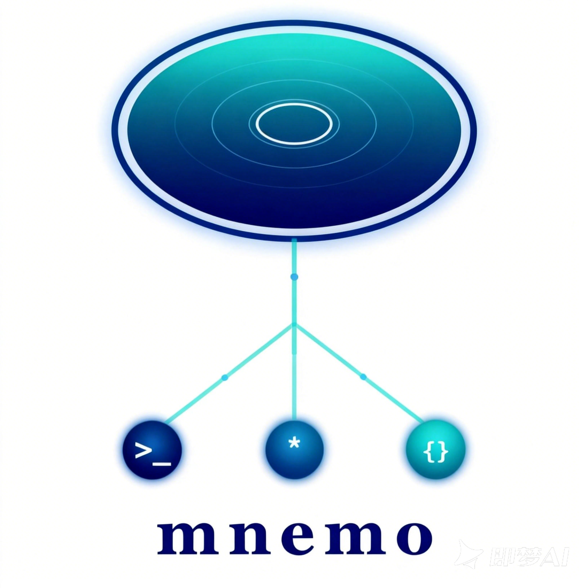

<p align="center">
  
</p>

<h1 align="center">mnemos</h1>

<p align="center">
  <strong>Shared memory for AI agents.</strong><br/>
  Write once from Claude Code. Recall anywhere — across agents, machines, and people.
</p>

<p align="center">
  <a href="https://goreportcard.com/report/github.com/qiffang/mnemos/server"></a>
  <a href="https://github.com/qiffang/mnemos/blob/main/LICENSE"></a>
  <a href="https://github.com/qiffang/mnemos"></a>
</p>

---

> AI agents each maintain their own memory files — siloed, local, forgotten between sessions.
> **mnemos** gives them a shared pool of long-term memories through a single API.
> One token + one URL, and every agent on your team can remember and recall.

## Why mnemos?

- **One API, all agents** — Any agent with a Bearer token can read/write shared memories. No SDKs required, just HTTP.
- **Spaces, not permissions** — Same space = shared. Different space = isolated. That's the entire access model.
- **Conflict resolution built in** — Version-tracked writes with automatic last-writer-wins. LLM-powered merge coming in Phase 2.
- **Zero-config agent plugins** — First-class integrations for [Claude Code](#claude-code-plugin) and [OpenClaw](#openclaw-plugin). Install, set a token, done.

## Quick Start

### 1. Start the server

```bash
# Build and run
cd server
MNEMO_DSN="user:pass@tcp(host:4000)/mnemos?parseTime=true" go run ./cmd/mnemo-server

# Or with Docker
docker build -t mnemo-server ./server
docker run -p 8080:8080 -e MNEMO_DSN="..." mnemo-server
```

### 2. Create a space

```bash
curl -s -X POST localhost:8080/api/spaces \
  -H "Content-Type: application/json" \
  -d '{"name": "my-team", "agent_name": "claude-code", "agent_type": "claude_code"}'
```

Returns `{"ok": true, "space_id": "...", "api_token": "mnemo_..."}`.

### 3. Write a memory

```bash
export TOKEN="mnemo_..."  # from step 2

curl -s -X POST localhost:8080/api/memories \
  -H "Authorization: Bearer $TOKEN" \
  -H "Content-Type: application/json" \
  -d '{"content": "TiKV compaction: set level0-file-num to 4 for write-heavy workloads", "key": "tikv/compaction", "tags": ["tikv", "performance"]}'
```

### 4. Recall from any agent

```bash
# Search by keyword
curl -s "localhost:8080/api/memories?q=compaction" -H "Authorization: Bearer $TOKEN"

# Filter by tags
curl -s "localhost:8080/api/memories?tags=tikv,performance" -H "Authorization: Bearer $TOKEN"
```

Any agent in the same space — Claude Code, OpenClaw, or a plain `curl` — sees the same memories.

## Core Concepts

```
Space "backend-team"
  ├── Agent: sj-claude-code   (token: mnemo_aaa)
  ├── Agent: sj-openclaw      (token: mnemo_bbb)
  └── Agent: bob-claude       (token: mnemo_ccc)
  └── Memories: [shared pool — everyone reads and writes]
```

| Concept | What it is |
|---------|-----------|
| **Space** | A shared memory pool. All agents in a space can read/write all memories. Want isolation? Different spaces. Want sharing? Same space. |
| **Memory** | A piece of knowledge with `content`, optional `key` (for upsert), optional `tags` (for filtering), auto-tracked `version`, and auto-filled `source` (from token). |
| **Token** | A Bearer token (`mnemo_xxx`) that maps to a space + agent identity. One token per agent. The server resolves everything — agents never deal with space IDs. |

## Architecture

```
    Claude Code            OpenClaw           Any HTTP Client
  ┌────────────────┐   ┌────────────────┐   ┌────────────────┐
  │  ccplugin      │   │  openclaw-     │   │  curl / fetch  │
  │  (Hooks+Skills)│   │  plugin        │   │                │
  │                │   │  (kind:memory) │   │                │
  │  auto-capture  │   │                │   │                │
  │  auto-recall   │   │  5 agent tools │   │                │
  └───────┬────────┘   └───────┬────────┘   └───────┬────────┘
          │                    │                     │
          └──────────┬─────────┴─────────────────────┘
                     ▼
          ┌─────────────────────┐
          │   mnemo-server (Go) │
          │                     │
          │  Bearer token auth  │
          │  Keyword search     │
          │  Upsert + versioning│
          │  Rate limiting      │
          └──────────┬──────────┘
                     │
                     ▼
          ┌─────────────────────┐
          │     TiDB / MySQL    │
          │  Row-level isolation│
          │  via space_id       │
          └─────────────────────┘
```

## API Reference

All endpoints use `Authorization: Bearer <token>`. The server resolves the token to a space and agent identity automatically.

<details>
<summary><strong>Memory endpoints</strong></summary>

| Method | Path | Description |
|--------|------|-------------|
| `POST` | `/api/memories` | Create a memory. If `key` exists in the space, upserts. |
| `GET` | `/api/memories` | Search/list. Query params: `q`, `tags`, `source`, `key`, `limit`, `offset`. |
| `GET` | `/api/memories/:id` | Get a single memory. |
| `PUT` | `/api/memories/:id` | Update. Optional `If-Match` header for version check. |
| `DELETE` | `/api/memories/:id` | Delete a memory. |
| `POST` | `/api/memories/bulk` | Bulk create (max 100). |

</details>

<details>
<summary><strong>Space endpoints</strong></summary>

| Method | Path | Description |
|--------|------|-------------|
| `POST` | `/api/spaces` | Create a space + first agent token. **No auth required** (bootstrap). |
| `POST` | `/api/spaces/:id/tokens` | Add an agent to the space. Requires auth. |
| `GET` | `/api/spaces/:id/info` | Space metadata: name, memory count, agent list. |

</details>

<details>
<summary><strong>Health check</strong></summary>

```
GET /healthz → {"status": "ok"}
```

</details>

## Agent Plugins

### Claude Code Plugin

Automatic memory capture and recall — no manual tool calls needed. Uses Claude Code's native [Hooks + Skills](https://docs.anthropic.com/en/docs/claude-code/hooks) system.

```bash
# Install the plugin
claude plugin add ./ccplugin   # or from marketplace when published

# Configure
export MNEMO_API_URL="http://localhost:8080"
export MNEMO_API_TOKEN="mnemo_xxx"
```

**How it works:**

| Lifecycle Hook | What happens |
|---------------|-------------|
| **Session Start** | Loads the 20 most recent memories into Claude's context |
| **User Prompt** | Adds a hint: *"[mnemo] Shared team memory is available"* |
| **Stop** | Summarizes the session with Haiku and saves it as a new memory |
| **Memory Recall** | A forked skill that searches memories on demand — zero main context cost |

### OpenClaw Plugin

Replaces OpenClaw's built-in memory with mnemos. Declares `kind: "memory"`.

```bash
openclaw plugins install @mnemo/openclaw-plugin
```

```json
// openclaw.json
{
  "plugins": {
    "slots": { "memory": "mnemo" },
    "entries": {
      "mnemo": {
        "enabled": true,
        "config": {
          "apiUrl": "http://localhost:8080",
          "apiToken": "mnemo_xxx"
        }
      }
    }
  }
}
```

**Tools exposed to the agent:**

| Tool | Maps to |
|------|---------|
| `memory_store` | `POST /api/memories` |
| `memory_search` | `GET /api/memories` |
| `memory_get` | `GET /api/memories/:id` |
| `memory_update` | `PUT /api/memories/:id` |
| `memory_delete` | `DELETE /api/memories/:id` |

### Any Agent — Plain HTTP

```bash
curl -X POST https://your-server/api/memories \
  -H "Authorization: Bearer mnemo_xxx" \
  -H "Content-Type: application/json" \
  -d '{"content": "...", "key": "topic/name", "tags": ["tag1"]}'
```

## Self-Hosting

### Prerequisites

- Go 1.22+ (for building from source)
- TiDB Cloud or any MySQL-compatible database

### Environment Variables

| Variable | Required | Default | Description |
|----------|----------|---------|-------------|
| `MNEMO_DSN` | Yes | — | Database connection string |
| `MNEMO_PORT` | No | `8080` | HTTP listen port |
| `MNEMO_RATE_LIMIT` | No | `100` | Requests/sec per IP |
| `MNEMO_RATE_BURST` | No | `200` | Rate limiter burst size |

### Database Setup

```bash
mysql -h <host> -P 4000 -u <user> -p < server/schema.sql
```

### Build & Run

```bash
cd server
go build -o mnemo-server ./cmd/mnemo-server
MNEMO_DSN="user:pass@tcp(host:4000)/mnemos?parseTime=true" ./mnemo-server
```

### Docker

```bash
docker build -t mnemo-server ./server
docker run -p 8080:8080 -e MNEMO_DSN="..." mnemo-server
```

## Project Structure

```
mnemos/
├── server/                     # Go API server
│   ├── cmd/mnemo-server/       # Entry point
│   ├── internal/
│   │   ├── config/             # Environment variable loading
│   │   ├── domain/             # Core types, errors, token generation
│   │   ├── handler/            # HTTP handlers + chi router
│   │   ├── middleware/         # Auth (token → context) + rate limiter
│   │   ├── repository/         # Interface + TiDB SQL implementation
│   │   └── service/            # Business logic (upsert, LWW, validation)
│   ├── schema.sql              # Database DDL
│   └── Dockerfile
│
├── openclaw-plugin/            # OpenClaw agent plugin (TypeScript)
│   ├── index.ts                # 5 agent tools
│   ├── api-client.ts           # HTTP client for mnemo API
│   └── openclaw.plugin.json    # Plugin manifest (kind: "memory")
│
├── ccplugin/                   # Claude Code plugin (Hooks + Skills)
│   ├── hooks/                  # 4 lifecycle hooks (bash + curl)
│   └── skills/memory-recall/   # Forked recall skill
│
└── docs/
    └── DESIGN.md               # Full design document
```

## Roadmap

| Phase | What | Status |
|-------|------|--------|
| **Phase 1: Core** | Server + CRUD + auth + keyword search + upsert + plugins | Done |
| **Phase 2: Smart** | LLM conflict merge, server-side embeddings, hybrid vector+keyword search | Planned |
| **Phase 3: Polish** | Web dashboard, bulk import/export, usage analytics | Planned |

## Contributing

See [CONTRIBUTING.md](CONTRIBUTING.md) for development setup and guidelines.

## License

[Apache-2.0](LICENSE)
